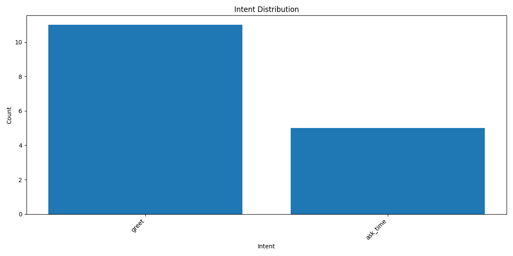
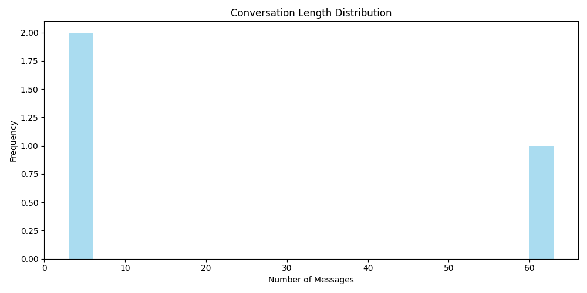

# Rasa Conversation Analysis Report

## 📊 Basic Statistics

- **Total Conversations:** 3
- **Total Messages:** 69
- **Average Messages per Conversation:** 23.00

## ⚠️ Fallback Analysis

- **Total Fallbacks:** 0
- **Conversations with Fallbacks:** 0

## 🎯 Intent Distribution

| Intent | Count | Percentage |
|--------|-------|------------|
| `greet` | 11 | 68.8% |
| `ask_time` | 5 | 31.2% |

## 📈 Visualizations

### Intent Distribution

### Conversation Lengths

