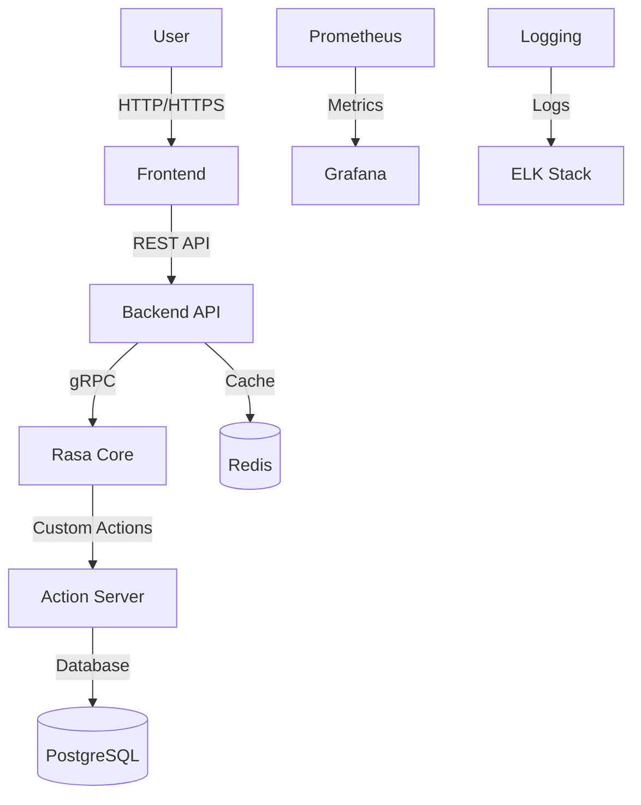

# System Architecture

This document provides a high-level overview of the Customer Care AI system architecture, including its components, data flow, and deployment strategies.

## Table of Contents
- [System Overview](#system-overview)
- [Architecture Diagram](#architecture-diagram)
- [Components](#components)
- [Data Flow](#data-flow)
- [Deployment](#deployment)
- [Scaling](#scaling)
- [Security](#security)
- [Monitoring & Logging](#monitoring--logging)

## System Overview

Customer Care AI is a microservices-based application with the following key characteristics:

- **Frontend**: Modern web interface built with React
- **Backend**: Rasa-based conversational AI with custom actions
- **Data Storage**: PostgreSQL for structured data, Redis for caching
- **Containerization**: Docker for consistent environments
- **Orchestration**: Docker Compose for local development, Kubernetes for production
- **Monitoring**: Prometheus for metrics, Grafana for visualization
- **CI/CD**: GitHub Actions for automated testing and deployment

## Architecture Diagram

## Components

### 1. Frontend

- **Technology Stack**: React, TypeScript, Vite, Tailwind CSS
- **Key Features**:
  - Responsive UI for all device sizes
  - Real-time chat interface
  - Analytics dashboard
  - User authentication
- **Dependencies**:
  - Backend API for data
  - WebSocket for real-time updates

### 2. Backend API

- **Technology Stack**: FastAPI, Python
- **Key Features**:
  - RESTful API endpoints
  - Authentication & Authorization
  - Request validation
  - Rate limiting
  - CORS support
- **Dependencies**:
  - Rasa Core for conversation management
  - Database for persistent storage
  - Redis for caching

### 3. Rasa Core

- **Technology Stack**: Rasa Open Source
- **Key Features**:
  - Natural Language Understanding (NLU)
  - Dialogue Management
  - Intent Classification
  - Entity Extraction
- **Dependencies**:
  - Custom actions server
  - NLU models
  - Policy configurations

### 4. Action Server

- **Technology Stack**: Python, Rasa SDK
- **Key Features**:
  - Custom action implementations
  - External API integrations
  - Database operations
  - Business logic
- **Dependencies**:
  - Database connections
  - External service APIs

### 5. Database

- **Primary Database**: PostgreSQL
  - User data
  - Conversation history
  - Analytics data
- **Cache**: Redis
  - Session storage
  - Rate limiting
  - Temporary data

## Data Flow

1. **User Interaction**:
   - User sends a message via the web interface
   - Frontend sends request to Backend API

2. **Request Processing**:
   - Backend validates the request
   - If cached response exists, return it
   - Otherwise, forward to Rasa Core

3. **Natural Language Processing**:
   - Rasa processes the message
   - Identifies intent and entities
   - Determines next action

4. **Action Execution**:
   - If custom action required, call Action Server
   - Execute business logic
   - Update database if needed

5. **Response Generation**:
   - Format response
   - Update conversation history
   - Cache response if appropriate
   - Return to user

## Deployment

### Development

- **Local Environment**:
  - Docker Compose for service orchestration
  - Hot-reloading for development
  - Local database instances

### Production

- **Container Orchestration**: Kubernetes
  - Auto-scaling
  - Load balancing
  - Self-healing
- **Database**: Managed PostgreSQL service
- **Caching**: Redis cluster
- **CDN**: For static assets

## Scaling

### Horizontal Scaling
- Stateless services can be scaled horizontally
- Load balancer distributes traffic
- Database read replicas for read-heavy workloads

### Caching Strategy
- Redis for session storage
- CDN for static assets
- Database query caching

## Security

### Authentication & Authorization
- JWT-based authentication
- Role-based access control (RBAC)
- Rate limiting
- CORS policies

### Data Protection
- Encryption at rest and in transit
- Regular security audits
- Dependency vulnerability scanning
- Secret management

## Monitoring & Logging

### Metrics Collection
- Prometheus for metrics
- Custom metrics for business KPIs
- Alerting with Alertmanager

### Logging
- Centralized logging with ELK stack
- Structured logging format
- Log rotation and retention policies

### Error Tracking
- Sentry for error tracking
- Performance monitoring
- User feedback collection

## CI/CD Pipeline

### Continuous Integration
- Automated testing
- Code quality checks
- Security scanning

### Continuous Deployment
- Automated deployments to staging
- Manual approval for production
- Blue-green deployments
- Canary releases

## Backup & Disaster Recovery

### Database Backups
- Automated daily backups
- Point-in-time recovery
- Off-site storage

### Disaster Recovery
- Multi-region deployment
- Failover procedures
- Regular disaster recovery drills
